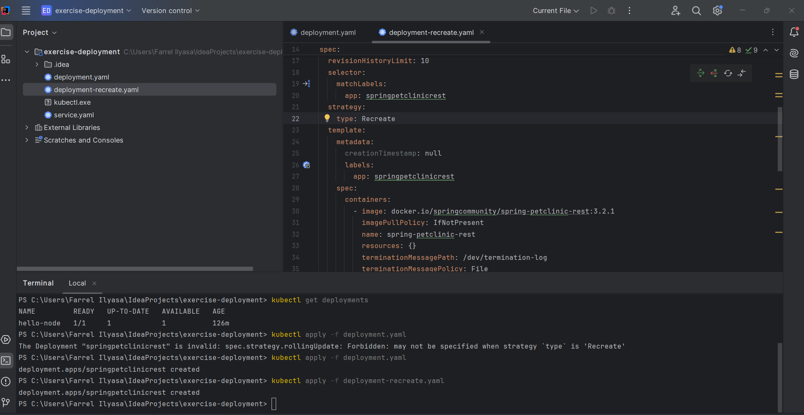

# Module 11 Reflection

## Reflection on Hello Minikube

1. Sebelum service di-expose, pesan pada log aplikasi hanya berisi pesan inisialisasi server seperti Stared HTP on port 8080. Namun, setelah service di-expose, pada log akan memunculkan tambahan berupa request yang didapat aplikasi. Setiap aplikasi dibuka, maka pesan log akan bertambah karena membuka aplikasi juga termasuk ke dalam request ke server.
2. Kegunaan dari posi '-n' pada kubectl get adalah untuk menetapkan resource pada namespace apa yang ingin ditampilkan. Jika tidaak ada opsi tersebut, maka resource akan mengambil pada namespace default

## Reflection on Rolling Update

1. Perbedaan dari rolling update dan recreate deployment startegy adalah, untuk rolling update update pod dilakukan secara bertahap, sedangkan pada recreate menghapus semua pod lama sebelum pod baru dibuat.
2. 
4. Dengan Manifest file proses deploy menjadi lebih struktur dan dapat diulang, kemudian dengan YAML dapat disimpan di git sehingga dapat digunakan untuk kolaborasi dan CI/CD.